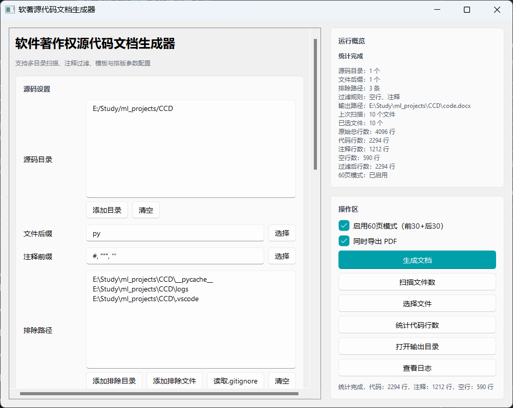

# Code Copyright Document Generator - 一键生成符合软著要求的源代码文档

## 📖 简介

CCD 是一个专为软件著作权申请设计的源代码文档生成工具。它能够自动扫描项目源码，按照软著规范生成符合格式要求的 Word 文档（.docx），大幅简化软著材料准备工作。

### 核心特性

- 🎯 **完全符合软著规范** - 自动处理页眉、页脚、页码、行距等格式要求
- 🚀 **图形化界面** - 现代化 Fluent Design 风格，可视化操作
- 📦 **智能代码识别** - 支持 30+ 种编程语言，自动识别注释和空行
- 🔧 **灵活配置** - 支持自定义字体、排版、页码格式、页边距等
- ⚡ **精确60页模式** - 基于 Word COM 自动化，精确提取前30页+后30页
- 📊 **代码统计** - 实时统计代码行数、文件数、语言分布
- 🎨 **文件管理** - 双栏设计，支持文件选择、排序、预览
- 📝 **完整日志** - 详细的操作日志，支持实时查看和问题排查
- 🌐 **多平台支持** - Windows、macOS、Linux 全平台支持（60页模式仅Windows）



## 📦 安装

### 环境要求

- **Python 3.6+**
- **操作系统**：Windows / macOS / Linux
- **60页模式额外要求**（可选）：
  - Windows 系统
  - Microsoft Word
  - pywin32 库

### 快速安装

```bash
# 克隆或下载项目
git clone https://github.com/your-username/CCD.git
cd CCD

# 安装基础依赖
pip install -r requirements.txt

# 如果需要使用60页模式（仅Windows）
pip install pywin32
```

### 依赖包说明

**核心依赖：**
```
python-docx>=0.8.11    # Word 文档生成（核心功能）
PyQt5>=5.15.0          # 图形界面框架
PyQt5-Qt5>=5.15.0      # Qt5 核心
qfluentwidgets>=1.1.0  # 现代化UI组件库
click>=8.0.0           # 命令行接口
```

**可选依赖（60页模式）：**
```
pywin32>=300           # Windows COM 自动化（仅Windows + 60页模式需要）
```

## 🚀 快速开始

### 方式一：图形界面（推荐）

```bash
python cli.py --gui
```

### 方式二：命令行

```bash
# 基础用法
python cli.py -i ./src -e py -o code.docx

# 完整示例
python cli.py \
  --title "我的软件V1.0" \
  --indir ./src \
  --indir ./lib \
  --ext py \
  --ext java \
  --exclude ./tests \
  --exclude ./node_modules \
  --outfile output.docx \
  --font-name Consolas \
  --font-size 10.5
```

## 📘 使用指南

### 图形界面使用流程

1. **配置源码目录**
   - 点击"添加目录"选择项目根目录
   - 可添加多个目录

2. **选择文件类型**
   - 点击"选择"按钮
   - 勾选需要的编程语言后缀（如 py, java, js）
   - 系统会自动扫描目录中的所有文件类型

3. **排除无关文件**
   - 添加 `node_modules`、`dist`、`build` 等目录到排除列表
   - 支持读取 `.gitignore` 文件
   - 避免将构建产物和第三方库写入软著文档

4. **扫描文件**
   - 点击"扫描文件数"
   - 查看符合条件的文件数量

5. **统计代码行数**
   - 点击"统计代码行数"
   - 查看过滤后的总行数、代码行、注释行、空行
   - 根据行数决定是否启用60页模式

6. **选择文件（可选）**
   - 点击"选择文件"打开文件选择对话框
   - **左右两栏设计**：左侧可选文件，右侧已选文件
   - **多选支持**：Ctrl+点击多选，Shift+点击范围选择
   - **双击操作**：左栏双击添加，右栏双击移除
   - **顺序调整**：置顶、上移、下移、置底
   - **文件预览**：点击文件名查看代码内容
   - **搜索过滤**：快速定位文件

7. **配置文档格式**
   - 设置页眉标题（软件名称+版本号）
   - 选择字体（推荐 Consolas 等宽字体）
   - 选择页码格式
   - 如果代码 ≥ 3000行，勾选"60页模式"

8. **生成文档**
   - 点击"生成文档"
   - 等待生成完成
   - 点击"打开输出目录"查看结果

### 命令行参数说明

```bash
python cli.py --help
```

| 参数 | 说明 | 示例 |
|------|------|------|
| `-t, --title` | 页眉标题 | `--title "我的软件V1.0"` |
| `-i, --indir` | 源码目录（可多个） | `-i ./src -i ./lib` |
| `-e, --ext` | 文件后缀（可多个） | `-e py -e java -e js` |
| `-c, --comment-char` | 注释前缀（可多个） | `-c "#" -c "//"` |
| `--font-name` | 字体名称 | `--font-name Consolas` |
| `--font-size` | 字号 | `--font-size 10.5` |
| `--space-before` | 段前间距 | `--space-before 0` |
| `--space-after` | 段后间距 | `--space-after 2.3` |
| `--line-spacing` | 行距 | `--line-spacing 10.5` |
| `--exclude` | 排除路径（可多个） | `--exclude ./tests` |
| `-o, --outfile` | 输出文件 | `-o code.docx` |
| `--template` | 模板文件 | `--template template.docx` |
| `--encoding` | 文件编码 | `--encoding utf-8` |
| `--keep-blank-lines` | 保留空行 | - |
| `--keep-comment-lines` | 保留注释 | - |
| `--gui` | 启动图形界面 | - |
| `-v, --verbose` | 调试信息 | - |

## 🎨 高级功能

### 60页模式详解

**什么是60页模式？**

软著申请要求提交源代码前30页和后30页，共60页。对于大型项目，CCD提供智能的60页模式。

**工作原理：**

1. **完整文档生成**：首先生成包含所有源代码的完整文档
2. **智能提取**：
   - 使用 Word COM 自动化技术
   - 精确提取前30页（保证代码开头完整）
   - 提取后30+页（含额外缓冲，确保代码结尾完整）
3. **自动调整**：
   - 如果页数超过60页：删除中间部分，保留前30页和最后30页
   - 如果页数少于60页：从原文档中间区域补充内容
   - 确保最后一页是代码结束且内容充足

**最终文档结构：**
```
第1-30页：  原文档开头（程序的入口、核心类等）
第31-X页：  中间内容（必要时自动补充）
第Y-60页：  原文档结尾（确保最后一页是代码结束）
```

**使用场景：**
- ✅ 大型项目（完整文档 > 60页）
- ✅ 符合软著规定（只需提交前30页+后30页）
- ✅ 自动确保60页准确

**启用方式：**
- **GUI**：勾选"启用60页模式"（推荐）
- **技术要求**：
  - 仅支持 Windows 系统
  - 需要安装 Microsoft Word
  - 需要安装 `pywin32`：`pip install pywin32`

**注意事项：**
- 60页模式会先生成完整临时文档，然后提取60页，耗时稍长
- 生成的文档严格保证60页，且最后一页为代码结束
- 如果 Word 不可用，会自动回退到普通模式

### Word COM 自动化支持

CCD 使用先进的 Word COM 自动化技术实现精确的60页提取：

**功能特性：**
- 🎯 **精确页面定位**：使用 `GoTo` 方法精确定位每一页
- 📄 **智能内容复制**：自动处理页面边界，避免内容截断
- 🔧 **自动页数调整**：智能补偿和删除，确保准确60页
- 🧹 **文档清理**：自动清理多余段落、空白页、分页符
- ✅ **多次验证**：保存后重新打开验证，确保页数准确

**实现细节：**
- 前30页：使用 `Range(0, page31_start)` 一次性提取
- 后30+页：提取最后35页作为缓冲，确保内容充足
- 自动调整：从中间删除或补充页面，保持前后结构完整
- 验证机制：生成后重新打开文档验证页数，不符合则自动调整

### 文件选择与预览

**功能特点：**
- 📂 左右两栏布局，操作直观
- 🔍 实时搜索，快速定位文件
- 👁️ 代码预览，支持语法识别
- 📊 显示文件大小、行数、语言类型
- ⚙️ 可调整预览行数（20/50/100/200）

**使用技巧：**
- 先扫描获取所有文件
- 通过搜索框快速过滤
- 点击文件名查看内容
- 调整文件顺序控制文档结构

### 注释过滤

**支持的语言：**
- Python (`#`, `"""`, `'''`)
- JavaScript/TypeScript (`//`, `/**/`)
- Java/C/C++ (`//`, `/**/`)
- Go/Rust/Swift (`//`, `/**/`)
- SQL (`--`, `/**/`)
- HTML/XML (`<!-- -->`)
- CSS (`/**/`)
- Shell (`#`)
- Ruby/Perl (`#`, `=begin =end`)
- 等 30+ 种语言

**智能识别：**
- 自动识别字符串中的注释符号
- 区分单行注释和多行注释
- 保留代码中的注释符号（如 URL 中的 `//`）

### 日志查看

**日志位置：**
- 项目根目录下的 `logs/` 文件夹
- `ccd.log` - 全部日志
- `ccd_error.log` - 错误日志

**日志功能：**
- 查看实时日志
- 切换全部日志/错误日志
- 清空当前日志
- 打开日志目录
- 自动轮转（最大10MB，保留5个备份）

## 🏗️ 项目结构

```
CCD/
├── cli.py                 # 命令行入口
├── logger.py              # 日志管理（自动轮转）
├── code_scanner.py        # 代码扫描（CodeFinder类）
├── code_processor.py      # 代码处理工具（语言识别、注释过滤）
├── doc_writer.py          # 文档写入（CodeWriter类，处理格式）
├── doc_generator.py       # 文档生成主流程
├── word_com_helper.py     # Word COM自动化（60页模式核心）
├── ui_main.py             # 主窗口界面（Fluent Design）
├── ui_dialogs.py          # 对话框组件（文件选择、日志查看）
├── ui_tasks.py            # 后台任务（Worker线程）
├── requirements.txt       # 依赖包列表
├── README.md              # 项目说明（本文件）
├── LICENSE                # MIT 许可证
└── logs/                  # 日志目录（自动创建）
    ├── ccd.log            # 完整日志
    └── ccd_error.log      # 错误日志
```

### 核心模块说明

**word_com_helper.py** - Word COM 自动化模块
- `check_word_available()` - 检查 Word 是否可用
- `extract_60_pages()` - 精确提取60页的核心算法
- `diagnose_document_pages()` - 文档页数诊断工具

**ui_dialogs.py** - 对话框组件
- `FileSelectDialog` - 文件选择对话框（双栏布局）
- `LogViewerDialog` - 日志查看器
- `PageNumberFormatDialog` - 页码格式选择器

**ui_tasks.py** - 后台任务
- `Worker` - 通用后台任务线程
- `ExtensionWorker` - 文件后缀扫描线程

## 📄 许可证

本项目基于 [MIT License](LICENSE) 开源。

## 🙏 致谢

- [python-docx](https://python-docx.readthedocs.io/) - Word文档生成核心库
- [PyQt5](https://www.riverbankcomputing.com/software/pyqt/) - 跨平台图形界面框架
- [qfluentwidgets](https://qfluentwidgets.com/) - 现代化 Fluent Design UI组件
- [pywin32](https://github.com/mhammond/pywin32) - Windows COM 自动化支持

<div align="center">
  <p>如果这个项目对你有帮助，请给个 ⭐ Star 支持一下！</p>
  <p>让软著申请变得更简单！</p>
</div>
