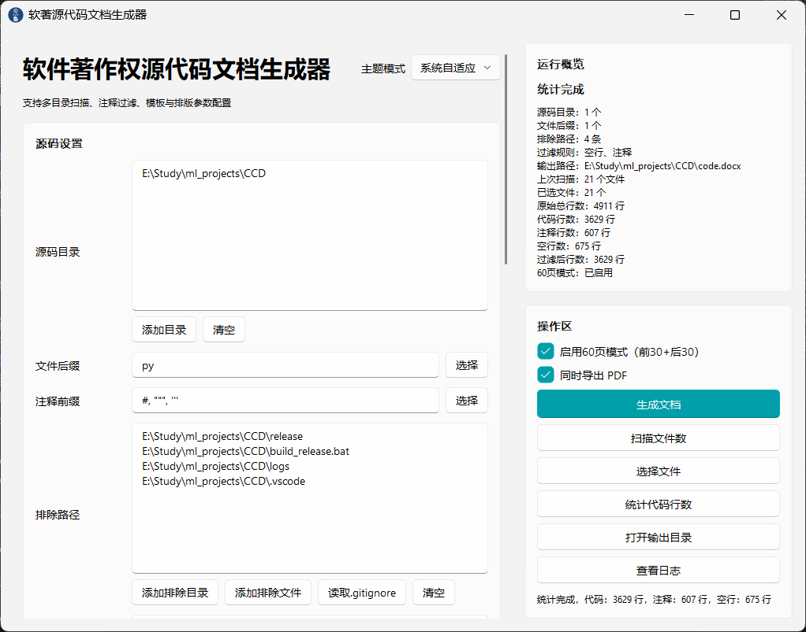

<div align="center">
  
  <h1>Code-Copyright-Docgen (CCD)</h1>
  <p><b>一键生成符合软件著作权申请要求的源代码文档</b></p>
  <p>CCD 是一个专为软件著作权申请设计的源代码文档生成工具。它能够自动扫描项目源码，按照软著规范生成符合格式要求的 Word 文档（.docx），并可同时导出 PDF，大幅简化软著材料准备工作。</p>
  
  <p>
    <a href="#-快速开始">快速开始</a> •
    <a href="#-使用指南">使用指南</a> •
    <a href="#-高级功能">高级功能</a> •
    <a href="#️-项目结构">项目结构</a>
  </p>
</div>

## ✨ 核心特性

- 🎯 **完全符合软著规范** - 自动处理页眉、页脚、页码、行距等格式要求。
- 🚀 **图形化界面** - 现代化 Fluent Design 风格，可视化操作，极简好用。
- 📦 **智能代码识别** - 支持 30+ 种主流编程语言，自动识别并过滤注释和空行。
- 🔧 **灵活排版配置** - 支持自定义字体、字号、页码格式、段前/段后间距、行距等。
- ⚡ **精确 60 页模式** - 基于 Word COM 自动化，精确提取前 30 页和后 30 页（软著提交标准）。
- 📄 **PDF 导出** - 一键将生成的 Word 文档（.docx）同步高保真导出为 PDF。
- 📊 **代码统计** - 实时统计代码行数、文件数、各语言分布比例。
- 🎨 **文件管理** - 双栏设计，支持文件手动选择、排序、预览和实时搜索过滤。
- 📝 **完整日志** - 记录详细的操作日志，支持在图形界面中实时查看和清空。
- 🌐 **多平台支持** - 基础生成功能支持 Windows、macOS 和 Linux（注：60页模式与 PDF 导出因依赖 Word COM 仅限 Windows 平台）。



## 🚀 快速开始

### 1. 环境要求

在使用本项目前，请确保您的系统满足以下要求：

*   **Python 核心**：Python 3.6+
*   **操作系统**：Windows / macOS / Linux
*   **高级功能额外要求（60页模式 / PDF 导出）**：
    *   仅支持 Windows 操作系统
    *   系统需安装 Microsoft Word（非 WPS/其他第三方 Office，Word COM 接口需要原装 Word 支持）
    *   需安装 `pywin32` 库

> [!NOTE]
> **Word 运行冲突警告**：在使用本软件时，请确保本机没有打开的 Word 窗口，且后台没有正在运行的 Word 进程。若存在被占用的 Word 进程，可能会因独占访问冲突而报错，导致无法正常写入并生成/裁剪文档。

### 2. 快速安装

```bash
# 1. 克隆或下载本项目
git clone https://github.com/your-username/CCD.git
cd CCD

# 2. 安装项目依赖
pip install -r requirements.txt
```

> [!TIP]
> **多平台依赖提示：**
> [requirements.txt](file:///e:/Study/ml_projects/CCD/requirements.txt) 默认包含了所有依赖。如果您在 **macOS** 或 **Linux** 系统上运行，安装时可能会因为平台不匹配而导致 `pywin32` 安装失败。此时可以编辑 [requirements.txt](file:///e:/Study/ml_projects/CCD/requirements.txt) 文件，删除或注释掉 `pywin32` 行，然后再重新执行安装。非 Windows 环境仅能使用基础文档生成功能。

### 3. 运行使用

#### 方式一：图形界面 (GUI) （推荐）

```bash
# 运行主程序启动图形化配置界面
python main.py
```

#### 方式二：命令行 (CLI)

```bash
# 基础用法：扫描当前 src 目录下所有的 py 文件并输出到 code.docx
python cli.py -i ./src -e py -o code.docx

# 同时导出 PDF
python cli.py -i ./src -e py -o code.docx --pdf

# 完整参数组合示例：多源码目录、指定多种语言后缀、排除测试与第三方依赖、自定义排版样式并输出 PDF
python cli.py \
  --title "我的软件V1.0" \
  --indir ./src \
  --indir ./lib \
  --ext py \
  --ext java \
  --exclude ./tests \
  --exclude ./node_modules \
  --outfile output.docx \
  --font-name Consolas \
  --font-size 10.5 \
  --pdf
```

## 📘 使用指南

### 图形界面使用流程

1.  **配置源码目录**：
    *   点击 "添加目录" 按钮，选择要导入的项目源码根目录。
    *   支持添加多个源码目录以进行合并。
2.  **选择文件类型**：
    *   点击后缀配置旁的 "选择" 按钮，在弹出的窗口中勾选需要的编程语言后缀（如 `py`、`java`、`js`）。
    *   程序会自动扫描目录中包含的所有文件后缀，也可手动勾选。
3.  **配置注释前缀（可选）**：
    *   点击注释前缀配置旁的 "选择" 按钮，可按语言批量勾选对应的注释前缀进行过滤。
4.  **排除无关目录**：
    *   将 `node_modules`、`dist`、`build`、`tests` 等文件夹路径添加到排除列表中。
    *   程序也支持直接读取 `.gitignore` 文件进行自动排除，避免将构建产物和第三方库写入软著文档。
5.  **文件扫描与代码行数统计**：
    *   点击 "扫描文件数" 可查看匹配的文件数。
    *   点击 "统计代码行数" 可对代码进行分析，查看过滤后的总行数、有效代码行、注释行和空行数量。
6.  **文件手动选择与排序（可选）**：
    *   点击 "选择文件" 打开高级文件选择窗口。
    *   **双栏设计**：左侧为可选文件，右侧为已选文件。
    *   **快速操作**：双击左侧添加，双击右侧移除。支持按文件名或代码行数进行排序。
    *   **顺序调整**：选中右侧文件后，可通过“置顶”、“上移”、“下移”、“置底”调整它们在最终生成 Word 中的合并顺序。
    *   **文件预览**：单击任意文件即可在下方预览其代码内容。
7.  **配置文档排版格式**：
    *   设置页眉标题（通常写：软件全称 + 版本号，例如：*我的软件系统 V1.0*）。
    *   选择字体（推荐等宽字体，如 `Consolas` 或 `宋体`）和字号。
    *   如果代码行数较多（建议 ≥ 3000行），勾选 "启用60页模式"。
    *   如需 PDF 交付件，勾选 "同时导出 PDF"。
8.  **生成文档**：
    *   点击 "生成文档" 按钮。生成完毕后，点击 "打开输出目录" 即可查看生成的成果。

### 命令行参数说明

您可以通过以下命令查看所有支持的命令行参数：
```bash
python cli.py --help
```

| 参数 | 说明 | 示例 |
| :--- | :--- | :--- |
| `-t, --title` | Word 页眉标题 | `--title "我的软件V1.0"` |
| `-i, --indir` | 源码目录（可指定多个） | `-i ./src -i ./lib` |
| `-e, --ext` | 提取的文件后缀（可指定多个） | `-e py -e java -e js` |
| `-c, --comment-char` | 手动指定需要过滤的单行注释前缀（可多个） | `-c "#" -c "//"` |
| `--font-name` | 字体名称 | `--font-name Consolas` |
| `--font-size` | 字号大小 | `--font-size 10.5` |
| `--space-before` | 段前间距 | `--space-before 0` |
| `--space-after` | 段后间距 | `--space-after 2.3` |
| `--line-spacing` | 行距倍数 | `--line-spacing 10.5` |
| `--exclude` | 需要排除的目录/文件路径（可多个） | `--exclude ./tests` |
| `-o, --outfile` | 输出的 Word 文件路径 | `-o code.docx` |
| `--template` | 自定义 Word 模板文件路径 | `--template template.docx` |
| `--encoding` | 文件读取编码（默认自动检测） | `--encoding utf-8` |
| `--keep-blank-lines` | 保留空行（默认过滤空行） | - |
| `--keep-comment-lines` | 保留注释（默认过滤注释） | - |
| `--pdf` | 是否同时导出 PDF 文件（仅限 Windows） | - |
| `--gui` | 启动图形界面 | - |
| `-v, --verbose` | 打印更详细的调试日志 | - |

## 🎨 高级功能

### 60页模式详解

> [!NOTE]
> **什么是 60 页模式？**
> 软件著作权申请规范中，要求提交的源代码材料为**前 30 页和后 30 页，总共 60 页**。如果直接合并大项目的代码，可能会有数百页，不符合提报要求。

#### 工作原理
1.  **完整生成**：首先读取所有选中并排序的文件，生成包含所有源码的临时 Word 文档。
2.  **智能提取**：
    *   通过 Word COM 自动化机制，精确定位到文档第 31 页的起点。
    *   直接截取前 30 页的内容（保留开头）。
    *   定位并截取原文档最后的 30+ 页内容作为缓冲（确保代码尾部完整性）。
3.  **自动补充与裁剪**：
    *   若提取后的总页数大于 60 页，则自动删除中间多余页，确保最终页数严格等于 60 页。
    *   若总页数少于 60 页，则自动从之前未被提取的中间段代码中取页进行补足。
    *   智能清洗多余的空白页、分页符以及段落标记，并再次重新加载文档进行最终的页数校对。

### PDF 导出

生成 Word 文档（.docx）后，系统会利用 Office Word 的原生 PDF 生成引擎进行转换：
*   **高保真度**：通过 Windows Word 的 `ExportAsFixedFormat` 接口导出，格式排版、页码、字体及页眉页脚样式与 Word 保持 100% 一致。
*   **独立保存**：生成的 PDF 文件会自动放置在与 .docx 文件相同的输出文件夹内，具有相同的文件名。

### Word COM 自动化

CCD 通过在后台调起 Windows 系统的 Microsoft Word 进程进行高级文档操作：
*   调用 [check_word_available()](file:///e:/Study/ml_projects/CCD/src/core/word_com_helper.py#L20) 实时评估本机 Word 环境是否可用。
*   使用 [extract_60_pages()](file:///e:/Study/ml_projects/CCD/src/core/word_com_helper.py#L39) 进行高难度的页级定位与裁剪合并。
*   调用 [convert_docx_to_pdf()](file:///e:/Study/ml_projects/CCD/src/core/word_com_helper.py#L569) 实现本地高保真 PDF 转换。
*   如果执行过程中 Word COM 环境遇到未启动或异常，系统会自动记录日志并退回到普通导出模式（即生成完整代码 docx，但不进行 60 页剪裁和 PDF 转换），保障基础功能不被中断。

> [!NOTE]
> 使用该软件的时候不可以有 Word 窗口正在使用或后台有 Word 进程运行，否则 Word COM 自动化会因为进程独占冲突而报错，导致无法写入并生成文档。

### 注释与空行智能过滤

程序能智能识别并移除 30+ 种常见语言的注释和空行，保证文档内容全是纯净有效的代码行。
*   **支持的语言**：Python、JavaScript、TypeScript、Java、C/C++、Go、Rust、SQL、HTML/XML、CSS、Shell 等。
*   **智能语义区分**：能够准确处理多行注释和块注释，且不会误伤代码字符串中包含的注释符号（例如 URL 中的 `http://` ）。

## 🏗️ Project Structure | 项目结构

```
CCD/
├── src/                        # 源码目录
│   ├── core/                   # 核心业务逻辑
│   │   ├── code_processor.py   # 代码处理（语言识别、编码检测、注释/空行过滤）
│   │   ├── code_scanner.py     # 代码文件扫描与各种行数统计
│   │   ├── doc_generator.py    # 业务主流程协调
│   │   ├── doc_writer.py       # Word (python-docx) 段落样式及表格写入
│   │   └── word_com_helper.py  # Word COM 自动化（60页裁剪与PDF转换）
│   ├── ui/                     # PyQt5 GUI 图形界面
│   │   ├── ui_main.py          # Fluent Design 主界面与配置绑定
│   │   ├── ui_dialogs.py       # 自定义对话框组件（文件管理、日志查看等）
│   │   └── ui_tasks.py         # 异步多线程执行任务（后缀扫描、文档生成工作器）
│   └── utils/                  # 工具类
│       └── logger.py           # 日志系统（包含自动轮转和过滤）
├── assets/                     # 静态资源与截图
│   ├── logo.ico                # 应用程序图标
│   └── img.png                 # README 界面效果截图
├── cli.py                      # 命令行启动入口
├── main.py                     # 图形界面启动入口
├── requirements.txt            # 项目依赖声明
├── LICENSE                     # MIT 开源协议书
└── logs/                       # 日志输出文件夹（运行后自动生成）
    ├── ccd.log                 # 完整运行时日志
    └── ccd_error.log           # 错误追踪日志
```

### 核心模块说明

#### 1. 核心逻辑

*   **[src/core/word_com_helper.py](file:///e:/Study/ml_projects/CCD/src/core/word_com_helper.py)**：
    *   [check_word_available()](file:///e:/Study/ml_projects/CCD/src/core/word_com_helper.py#L20) —— 检查运行环境下 Word 服务是否就绪。
    *   [extract_60_pages()](file:///e:/Study/ml_projects/CCD/src/core/word_com_helper.py#L39) —— 基于 COM 自动化提取前 30 页和后 30 页。
    *   [convert_docx_to_pdf()](file:///e:/Study/ml_projects/CCD/src/core/word_com_helper.py#L569) —— 高保真 DOCX 转 PDF 格式。
    *   [diagnose_document_pages()](file:///e:/Study/ml_projects/CCD/src/core/word_com_helper.py#L471) —— 辅助诊断当前 Word 文档的页数。
*   **[src/core/code_processor.py](file:///e:/Study/ml_projects/CCD/src/core/code_processor.py)**：
    *   提供代码编码解析、多行/单行注释的正则表达式过滤逻辑。
*   **[src/core/doc_writer.py](file:///e:/Study/ml_projects/CCD/src/core/doc_writer.py)**：
    *   处理 python-docx 文档样式设置、添加表格框线以及对代码行号进行自动标记。

#### 2. 对话框与多线程组件

*   **[src/ui/ui_dialogs.py](file:///e:/Study/ml_projects/CCD/src/ui/ui_dialogs.py)**：
    *   [ExtensionSelectDialog](file:///e:/Study/ml_projects/CCD/src/ui/ui_dialogs.py#L64) —— 弹出式文件后缀选择器。
    *   [CommentPrefixDialog](file:///e:/Study/ml_projects/CCD/src/ui/ui_dialogs.py#L171) —— 注释前缀详细配置器。
    *   [FileSelectDialog](file:///e:/Study/ml_projects/CCD/src/ui/ui_dialogs.py#L290) —— 双栏的高级文件筛选与人工排序器。
    *   [LogViewDialog](file:///e:/Study/ml_projects/CCD/src/ui/ui_dialogs.py#L905) —— 运行时日志控制与实时查看器。
*   **[src/ui/ui_tasks.py](file:///e:/Study/ml_projects/CCD/src/ui/ui_tasks.py)**：
    *   [GenerateWorker](file:///e:/Study/ml_projects/CCD/src/ui/ui_tasks.py#L15) —— 后台文档生成异步工作线程，避免生成大文件时 GUI 界面卡死。
    *   [ExtensionScanWorker](file:///e:/Study/ml_projects/CCD/src/ui/ui_tasks.py#L92) —— 后台源码目录后缀自动匹配与扫描器。

## 📄 许可证

本项目基于 [MIT License](file:///e:/Study/ml_projects/CCD/LICENSE) 协议开源。

## 🙏 致谢

本项目的开发离不开以下优秀开源库的支持：

*   [python-docx](https://python-docx.readthedocs.io/) - Word 文档生成核心库。
*   [PyQt5](https://www.riverbankcomputing.com/software/pyqt/) - 优秀的跨平台图形界面框架。
*   [qfluentwidgets](https://qfluentwidgets.com/) - 现代化 Fluent Design 风格 UI 组件库。
*   [pywin32](https://github.com/mhammond/pywin32) - Windows COM 自动化桥梁。

<div align="center">
  <p>如果这个项目对你有帮助，请给个 ⭐ Star 支持一下！</p>
  <p>让软著材料申请变得更简单！</p>
</div>
